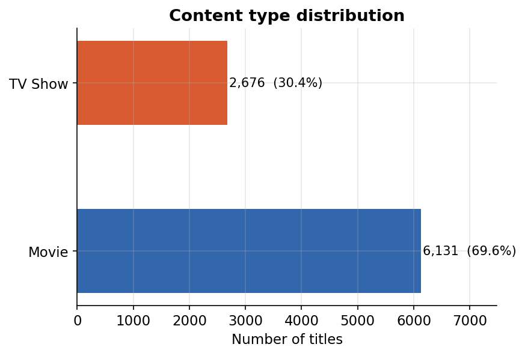
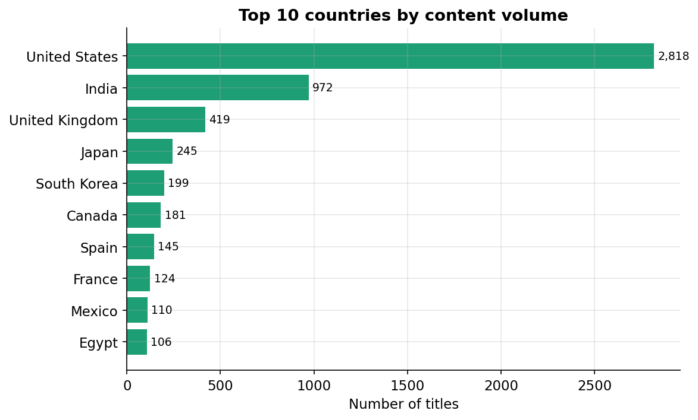
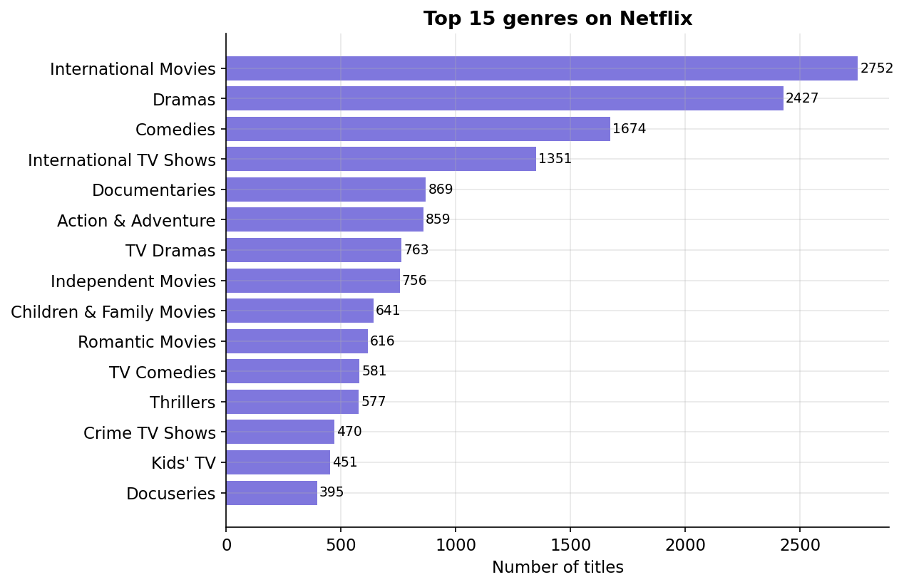
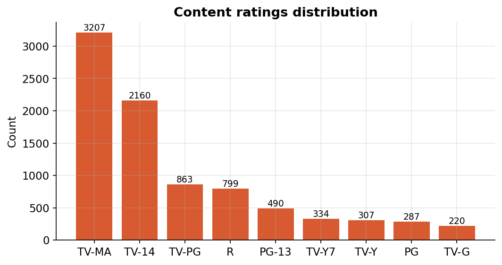
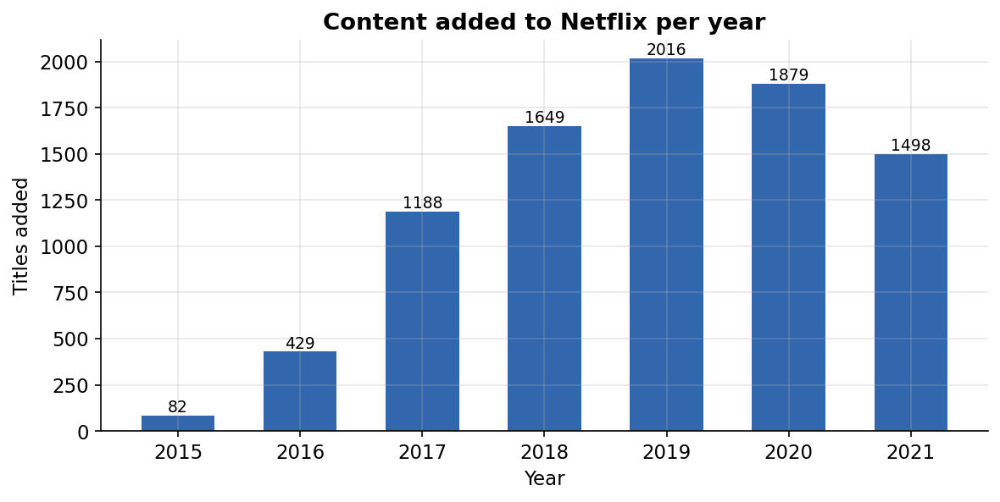

# 🎬 Netflix Exploratory Data Analysis

## 📖 About the Project

Netflix has become one of the world's largest streaming platforms, offering thousands of movies and TV shows across different countries and genres.

This project performs an Exploratory Data Analysis (EDA) on the Netflix Titles dataset to uncover content trends, identify patterns in production and distribution, and visualize insights that help better understand Netflix's content library.

---

## 🎯 Business Questions

This analysis aims to answer questions such as:

* Which type of content dominates Netflix?
* Which countries contribute the most content?
* How has Netflix's catalog grown over time?
* What are the most common genres?
* Which audience ratings appear most frequently?

---

## 🛠 Tech Stack

* Python
* Pandas
* NumPy
* Matplotlib
* Seaborn
* Jupyter Notebook

---

## 📂 Repository Structure

```
netflix-eda/
│── data/
│── outputs/
│── netflix_eda.ipynb
│── netflix_eda.py
│── requirements.txt
│── README.md
```
---
## 📈 Project Highlights

- 📺 Analyzed 8,800+ Netflix titles
- 📊 Created 11 data visualizations
- 🧹 Performed data cleaning and preprocessing
- 📈 Conducted exploratory data analysis (EDA)
- 🐍 Built using Python and Jupyter Notebook
---

## 📊 Key Findings

* Movies significantly outnumber TV Shows on Netflix.
* The United States is the largest content-producing country.
* Netflix experienced rapid content growth after 2015.
* Drama and Comedy are among the most represented genres.
* TV-MA is the most common maturity rating.

---

## 📸 Dashboard & Visualizations

The project includes multiple visualizations covering:

* Content Type Distribution
* Top Producing Countries
* Genre Analysis
* Content Ratings
* Release Trends
* Year-wise Content Growth

## 📸 Sample Visualizations

### 📺 Content Type Distribution



---

### 🌍 Top Content Producing Countries



---

### 🎭 Top Genres



---

### ⭐ Content Ratings Distribution



---

### 📈 Content Growth Over Time


---

## ▶️ Getting Started

Clone this repository

```bash
git clone <repository-url>
```

Install dependencies

```bash
pip install -r requirements.txt
```

Open the Jupyter Notebook:

```bash
jupyter notebook netflix_eda.ipynb
```

Or run the Python script:

```bash
python netflix_eda.py
```

---

## 📁 Dataset

This project uses the Netflix Titles dataset, which contains information about movies and TV shows available on Netflix, including title, genre, country, release year, rating, duration, and cast details.

---

## 👩‍💻 Author

**Ishika Singh**
If you found this project interesting, feel free to explore the repository and connect with me.
